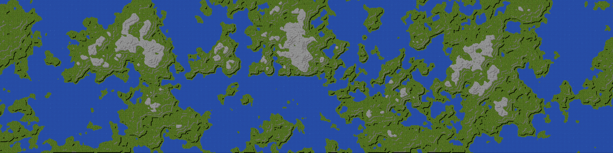

# Experimente!

Uma versão online desta aplicação pode ser encontrada em [http://inconcessus.github.io](http://inconcessus.github.io).

# OTMapGen

Protótipo simples para um gerador de mapas OpenTibia com semente de ruído simplex. Este gerador usa ruído simplex 2D para criar terrenos realistas. Bordas automáticas e detalhamento natural estão incluídos.

  

# Dependências

- O NodeJS deve ser instalado em sua máquina para o modo de desenvolvimento. Instale-o usando [NVM](https://github.com/nvm-sh/nvm).

# Como Usar

1. Execute `git clone https://github.com/Inconcessus/OTMapGen.git` para clonar o repositório.
2. Vá para `OTMapGen/` e execute `npm install`.
3. Execute `npm run watch` para monitorar alterações no código, ou simplesmente execute `node index.js` para gerar o arquivo OTBM.
4. Em seguida, procure pela saída: `map.otbm`.

- É opcional modificar a semente do ruído e alterar alguns parâmetros de geração dentro do script de geração.

# Versão

Versão 1.5.5. Este é um trabalho em andamento.
